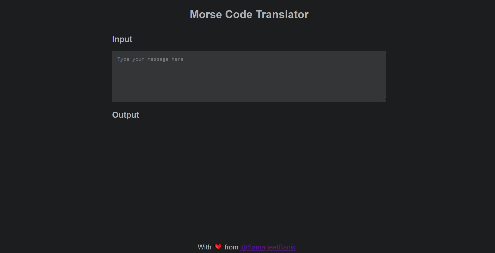
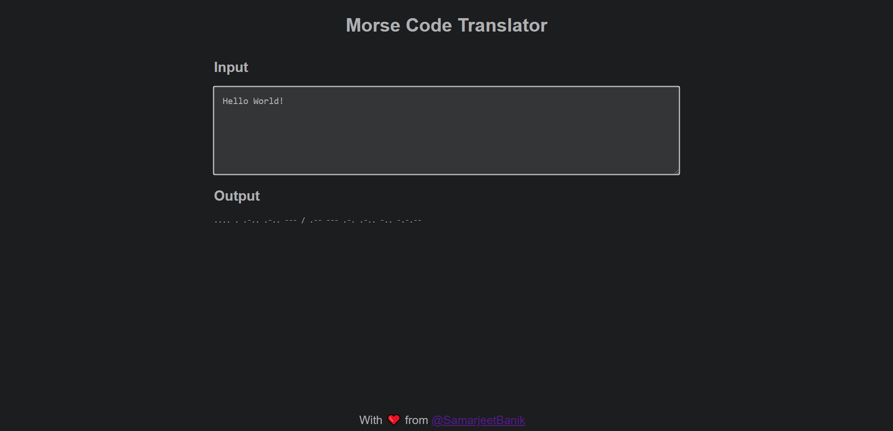

# Morse Code Translator

A simple React-based "Morse Code Translator", that can translate yours words to Morse codes.

### Live App Demo: :arrow_right: [Click here](https://samarjeetbanik.github.io/morse-code-translator/)

## Snapshots of the web- app

#### **If you liked the project, then, don't forget to give a 🌟 to this repo.**

### **With ❤️ from [@SamarjeetBanik](https://github.com/SamarjeetBanik)**

# Thank You!!! 😄
